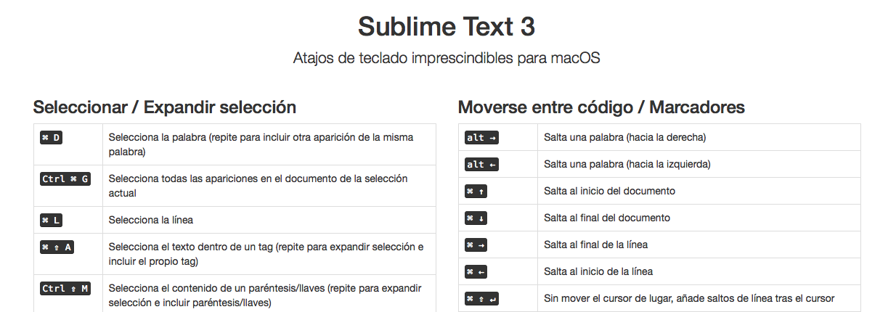

Sublime Text - guía básica
==========================

Una web sencilla para que puedas consultar algunos de los atajos de teclado para macOS más útiles para Sublime Text.

Puedes usar esta web directamente en tu equipo local (no es necesario disponer de servidor web). Simplemente abré el fichero "index.html" en tu navegador.

--------------------------

--------------------------

Proyecto liberado en 2017 bajo licencia "MIT License". 